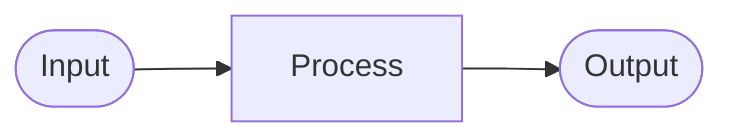

# Output Length Guard (Rust)
> Author: ContextForge Contributors
> Version: 0.1.0

Rust backed output length guard plugin for MCP Gateway

## Hooks
- `tool_post_invoke` – TODO: Add description

## Config
```yaml
config:
    # TODO: Add configuration options
    example_option: "value"
```

## Config Description

* **example_option**
  - TODO: Document this configuration option

## Architecture

TODO: Add architecture diagram (use Mermaid)



## Logic Workflow

1. **Initialization**
   - Plugin is initialized with configuration
   - TODO: Document initialization steps

2. **Hook Execution**
- `tool_post_invoke`: TODO: Document hook behavior

3. **Result**
   - TODO: Document expected outcomes

## Features

- ✅ High-performance Rust implementation
- ✅ Python integration via PyO3
- ✅ Type-safe configuration with Pydantic
- TODO: Add more features

## Limitations

- TODO: Document known limitations
- TODO: Document edge cases

## TODOs

- [ ] Implement core functionality in `src/engine.rs`
- [ ] Add comprehensive unit tests
- [ ] Add integration tests
- [ ] Document configuration options
- [ ] Add architecture diagrams
- [ ] Add usage examples

## Development

### Building

```bash
make sync          # Install dependencies
make install       # Build and install
make test-all      # Run all tests
```

### Testing

```bash
make test          # Rust tests
make test-python   # Python tests
make test-all      # Both
```

### CI Verification

```bash
make ci            # Full CI verification
```

## Tests

TODO: Add test coverage information

**Run tests:**
```bash
cargo nextest run -p output_length_guard  # Run Rust unit tests
pytest tests/                 # Run Python tests
```

## Performance

TODO: Add performance characteristics
## References

- [CPEX Plugin Framework](../../../../README.md)
- [Development Guide](../../../../DEVELOPING.md)
- [Testing Guide](../../../../TESTING.md)
